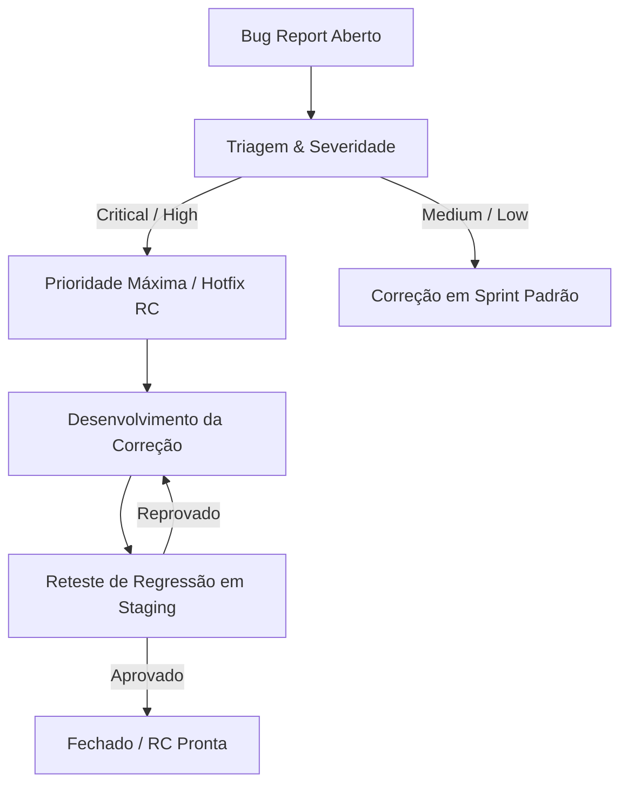

# 🐞 Gestão de Bugs e Estabilização de Release Candidate — IP3D

Este documento estabelece o protocolo de triagem, priorização, reteste e controle de regressão para erros identificados durante a janela de homologação do **Release Candidate (RC)**. Ele orienta as equipes de engenharia, QA e produto nos critérios de Go/No-Go para deploy seguro em produção.

---

## 🔄 1. Fluxo de Triagem e Ciclo de Vida do Bug

Todo bug identificado no ambiente de Staging deve seguir o fluxo de triagem e resolução:



### Estados do Bug:
1.  **Novo (Triage):** Bug reportado pela equipe de testes aguardando validação técnica.
2.  **Confirmado:** Bug reprodutível e mapeado pelo time de desenvolvimento.
3.  **Em Correção:** Engenheiro trabalhando no hotfix do código.
4.  **Aguardando Validação:** Correção publicada no ambiente de Staging para reteste.
5.  **Validado (Fechado):** Aprovado pelo QA após testes de regressão.

---

## ⚡ 2. Severidades e SLAs de Correção em Janela de Release

Durante a janela de estabilização do Release Candidate, aplicamos os seguintes SLAs:

| Severidade | Impacto Técnico | SLA de Correção | Ação de Deploy (Go/No-Go) |
| :--- | :--- | :--- | :--- |
| **Bloqueante (Critical)** | Quebra funcionalidade crítica (frete, checkout, login de admin, banco corrompido). | **Imediato (Max 4 horas)** | **NO-GO Automático.** Impede qualquer deploy em produção. |
| **Alta (High)** | Impacto severo na experiência do usuário ou painel administrativo, mas com workaround manual. | **Max 12 horas** | **NO-GO Condicional.** Requer hotfix na RC ativa ou aprovação do Release Manager. |
| **Média (Medium)** | Problema cosmético ou bug de navegação secundária em tela específica. | **Max 48 horas** | **GO Monitorado.** Deploy em produção é permitido; correção entra no backlog da sprint seguinte. |
| **Baixa (Low)** | Erros ortográficos menores, warnings inofensivos em console ou inconsistências de fontes. | **Backlog Padrão** | **GO Permitido.** Sem impacto operacional. |

---

## 📋 3. Template Oficial de Bug Report (Janela de RC)

Para garantir que os bugs relatados possuam dados acionáveis, todos os reports na pasta `/bugs/` ou issues do GitHub devem obrigatoriamente seguir o checklist:

```markdown
### 🐞 Registro de Bug do Release Candidate

*   **ID do Bug:** RC-BUG-[Número]
*   **Data do Registro:** AAAA-MM-DD
*   **Versão do Release Candidate:** vX.Y.Z-rcN
*   **Ambiente:** Staging / Local
*   **Título:** [Breve descrição resumindo o problema]

---

### 🔍 Descrição do Problema
[Escreva o que está ocorrendo e qual o sintoma observado no sistema]

### 👣 Passos para Reproduzir
1. Vá para o link '...'
2. Clique em '...'
3. Preencha os campos com '...'
4. Veja o erro/comportamento inesperado '...'

### 🎯 Resultados
*   **Resultado Esperado:** [O que deveria acontecer?]
*   **Resultado Obtido:** [O que realmente aconteceu?]

### 📁 Evidências
*   **Prints/Vídeos:** [Links para prints ou gravações da tela de homologação]
*   **Logs Transacionais:** [Trechos de logs obtidos via logger ou console]
*   **ID da Transação/Pedido (se houver):** [PreferenceId, orderId]

### 🛡️ Governança
*   **Severidade:** Bloqueante (Critical) / Alta (High) / Média (Medium) / Baixa (Low)
*   **Responsável Técnico (Owner):** [Nome do Engenheiro]
*   **Status Atual:** Novo / Confirmado / Em Correção / Validado
```

---

## 🔍 4. Critérios de Reteste e Regressão

Após a publicação de um hotfix corretivo em Staging, o QA deve executar o checklist de regressão:
1.  **Isolamento da Correção:** Testar diretamente os cenários descritos nos "Passos para Reproduzir" do Bug Report para assegurar que a falha foi resolvida.
2.  **Cercamento de Impacto (Regressão):** Executar testes nas áreas adjacentes à modificação (ex: se o bug era na validação de CPF do checkout, testar também o cálculo do frete e a gravação do status final do pedido para evitar regressões).
3.  **Sanidade Geral:** Rodar a suíte completa de testes de integração e unitários localmente (`pnpm test`).

---

## ❄️ 5. Declaração Formal de Technical Freeze

Após auditoria exaustiva do repositório da IP3D na presente data, confirmamos os seguintes fatos:
*   **Suíte de Testes:** **325 testes passando com 100% de sucesso.**
*   **Qualidade de Código:** **0 erros** acusados pelo ESLint estático.
*   **Prisma Client & Schema:** Esquema de banco de dados validado e íntegro.
*   **Compilação:** Next.js build final de produção compilado com sucesso absoluto (Exit Code 0).
*   **Bugs Relatados:** **Nenhum bug ativo ou não resolvido foi catalogado.**

Desta forma, a engenharia sênior declara formalmente o **Release Candidate (RC) em estado de Freeze Técnico (Technical Freeze)**. Nenhuma nova funcionalidade ou refatoração visual será permitida nesta versão, assegurando estabilidade absoluta para o deploy definitivo em produção.
