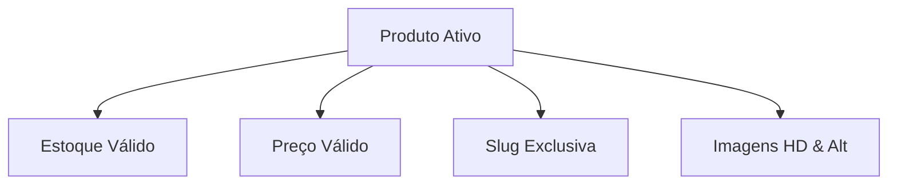

# 📦 Checklist de Revisão Final de Conteúdo, Catálogo e SEO — IP3D

Este documento estabelece as diretrizes e os checklists de auditoria final para conteúdo, produtos, SEO e termos legais antes da abertura definitiva da plataforma **IP3D** ao público.

---

## 🛍️ 1. Checklist de Catálogo e Produtos

### 1.1 Regras de Validação de Produtos Ativos:
- [ ] **Imagens Obrigatórias:** Todo produto ativo deve possuir pelo menos uma imagem principal carregada em alta definição no storage de produção (Vercel Blob), com caminhos físicos válidos.
- [ ] **Slug Único:** Todo produto ativo deve possuir slug em formato URL-friendly (`/produtos/kit-hotend-bambu-lab`) sem caracteres especiais ou espaços, garantindo rotas 100% amigáveis.
- [ ] **Preços Consistentes:** Todo produto ativo deve ter preço maior que zero (`price > 0`) e, caso haja desconto, o preço promocional deve ser menor que o preço cheio (`promoPrice < price`).
- [ ] **Controle de Estoque Inicial:** O estoque inicial de cada item no banco de dados deve refletir com exatidão o inventário físico real armazenado no centro de distribuição, registrando o estado inicial na tabela `InventoryLog`.
- [ ] **Categorias e Slugs:** Cada categoria ativa no banco de dados deve conter slug válido e estar associada de forma consistente aos produtos do catálogo.

---

## 🖼️ 2. Banners, Home e CMS Dinâmico
- [ ] **Dimensões e Proporções:** Certificar que as imagens dos banners da Home possuem as proporções otimizadas para Desktop (1920x600px) e Mobile (600x400px), reduzindo o tempo de LCP.
- [ ] **Acessibilidade nos Banners:** Garantir que todos os banners ativos possuam atributo `alt` textual explicativo para leitores de tela e link interno ou externo coerente.
- [ ] **Seções de Destaque:** Validar que as seções dinâmicas ativas da página Home (CMS) referenciem produtos existentes e ativos na base de dados de produção.

---

## 🔍 3. Otimização de SEO e Links
- [ ] **Meta Tags Globais:** Certificar que a Home e as páginas institucionais possuem tags `<title>` descritivas e meta tags `<description>` otimizadas com palavras-chave relevantes de impressão 3D (comprimento entre 120 e 160 caracteres).
- [ ] **Links Absolutos e Relativos:** Auditar todos os links e referências do site (cabeçalho, rodapé e conteúdos) para garantir que **nenhum** aponte para ambientes de desenvolvimento (`localhost`) ou staging (`staging.ip3d.com.br`).
- [ ] **Páginas Institucionais:** Validar que as páginas `/sobre` e `/contato` renderizam textos corporativos reais, e-mails de atendimento e telefones corretos, sem placeholders (ex: "Lorem Ipsum" ou "e-mail@exemplo.com").

---

## ⚖️ 4. Textos Legais e Termos
- [ ] **Política de Privacidade:** Página `/p/politica-de-privacidade` atualizada com o detalhamento de coleta, armazenamento e uso de dados pessoais (em total conformidade com a LGPD brasileira).
- [ ] **Termos de Uso:** Página `/p/termos-de-uso` contendo as regras de compra, garantias de filamentos/peças, prazos de devolução pelo direito de arrependimento (7 dias) e regras de frete.
- [ ] **Consentimento LGPD:** Certificar que o banner de aceitação de cookies na Home bloqueia o disparo de PageViews e Clicks para o analytics até que o consentimento voluntário do usuário seja explicitamente registrado.
- [ ] **Endereço e Contatos no Rodapé:** CNPJ ativo, razão social completa, endereço físico do centro de distribuição e canais de suporte claramente visíveis no rodapé de todas as páginas do storefront.

---

## 🎯 5. Critérios Go/No-Go de Conteúdo

A liberação comercial está condicionada ao sucesso total dos seguintes pontos:

| Área Auditada | Critério de Sucesso (Go) | Critério de Rejeição (No-Go) |
| :--- | :--- | :--- |
| **Produtos** | Todos os produtos ativos possuem imagens HD, preço válido e estoque real. | Qualquer produto ativo sem imagem, com estoque zerado indevidamente ou preço R$ 0,00. |
| **Links** | 100% dos links direcionam para rotas de produção seguras. | Presença de links apontando para `localhost` ou `staging`. |
| **Dados Legais** | CNPJ, política de privacidade e termos revisados e vigentes. | Falta de dados legais ou presença de textos em formato placeholder ("lorem ipsum"). |
