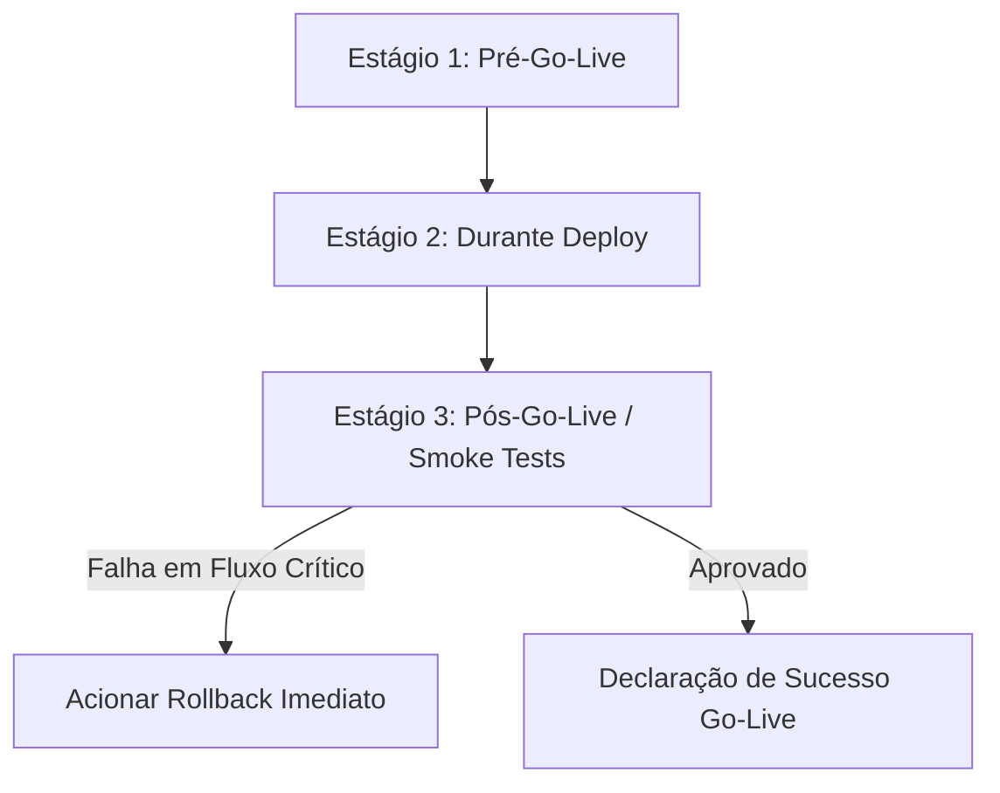

# 🚀 Protocolo Go-Live e Publicação em Produção — IP3D

Este documento estabelece o roteiro e os checklists oficiais para o lançamento do storefront **IP3D** no ambiente de **Produção**. Ele orienta os engenheiros de deploy, DevOps, administradores de sistemas e gerentes de liberação em todas as etapas críticas do go-live, garantindo resiliência, governança de dados e integridade de ponta a ponta.

---

## 📅 1. Planejamento e Janela de Deploy
*   **Janela de Deploy Sugerida:** Terças e Quartas-feiras entre **01:00h e 04:00h** (horário de menor volume de acessos e transações no e-commerce).
*   **Comunicação Prévia:** Informar as equipes de suporte ao cliente e marketing digital sobre a indisponibilidade temporária programada com pelo menos 24 horas de antecedência.

---

## 📋 2. Checklists Operacionais Go-Live



### Estágio 1: Pré-Go-Live (Preparação e Proteção)
- [ ] **Technical Freeze:** Confirmar que a branch `master` de deploy está sob freeze técnico, sem novos commits que não sejam de hotfixes críticos homologados.
- [ ] **Sucesso de CI/CD:** Garantir que a última execução do GitHub Actions está 100% verde (testes, lint, build e seeds dev bem-sucedidos).
- [ ] **Variáveis de Ambiente:** Auditar e validar todas as variáveis no arquivo `.env` de produção, assegurando:
    *   `NODE_ENV=production`
    *   `DATABASE_URL` apontando para o banco físico real.
    *   `SESSION_SECRET` configurado com chave criptográfica robusta de 32+ caracteres.
    *   Credenciais do Mercado Pago e do provedor de frete ativas e devidamente mascaradas nos logs.
- [ ] **Backup Quente Ativo:** Executar o script de backup seguro para garantir um ponto de restauração válido do banco de dados antes de qualquer alteração física:
    ```bash
    pnpm db:backup
    ```

### Estágio 2: Durante o Deploy (Publicação)
- [ ] **Paralisação de Tráfego:** Apresentar tela estática temporária de manutenção para os usuários finais.
- [ ] **Migrações do Prisma:** Aplicar o esquema físico de banco de dados e migrações pendentes em produção:
    ```bash
    pnpm db:deploy
    ```
- [ ] **Sincronização de Dados (Seeds):** Executar os dados estáticos de banners e blocos essenciais no banco físico real de forma assistida:
    ```bash
    pnpm seed:prod:safe
    ```
- [ ] **Configuração do Administrador Primário:** Criar ou certificar a conta administrativa utilizando a senha robusta definida na política de segurança:
    ```bash
    pnpm create-admin:safe --email admin@ip3d.com.br --password SUA_SENHA_FORTE
    ```
- [ ] **Compilação e Reinicialização:** Executar o build no servidor e recarregar os processos no PM2:
    ```bash
    pnpm build
    pm2 reload all
    ```

### Estágio 3: Pós-Go-Live (Smoke Tests e Validações Finais)
- [ ] **Certificado SSL:** Confirmar que o domínio público `https://www.ip3d.com.br` está respondendo sob SSL (HTTPS) com certificado ativo e válido.
- [ ] **Verificação de Health Check:** Executar um curl no endpoint `/api/health` e validar se o retorno é `200 OK` e o banco PostgreSQL está conectado.
- [ ] **Sanidade SEO:** Validar o acesso público a `/robots.txt` e `/sitemap.xml`, garantindo a indexação correta para motores de busca.
- [ ] **Headers de Segurança:** Auditar os headers HTTPs garantindo o bloqueio de Iframe clickjacking, HSTS ativo e CSP restritiva.
- [ ] **Jornada de Checkout de Produção:** Realizar uma compra de teste de valor irrisório com dados de pagamento reais (cartão de crédito físico ou PIX real) para atestar a comunicação de ponta a ponta com a API do Mercado Pago.
- [ ] **Validação de Webhook:** Certificar a conciliação de pagamentos reais pós-apuração no Mercado Pago, garantindo a atualização do pedido no painel de vendas e a respectiva baixa física na tabela de estoque.
- [ ] **Consentimento de Cookies e Analytics:** Confirmar que PageViews e Clicks em `/api/analytics` só são registrados após aceitação do banner LGPD.

---

## 🎯 3. Critérios de Decisão (Go/No-Go)

| Fator de Avaliação | Condição de Aprovação (Go) | Condição de Bloqueio (No-Go) |
| :--- | :--- | :--- |
| **Banco de Dados** | Migrações aplicadas e tabelas sincronizadas de forma íntegra. | Falha na execução do `db:deploy` ou corrupção de dados. |
| **Processamento de Pagamento** | Venda real de teste concluída e faturada. | Falha de redirecionamento, erros de comunicação com a API Mercado Pago. |
| **Baixa de Estoque** | Estoque físico do produto decrementado e log gravado. | Inconsistência na quantidade residual pós-venda. |
| **Segurança** | Headers HSTS ativos, SSL ativo e sem vazamento de secrets. | SSL quebrado, vazamento de credenciais em logs ou senhas padrões ativas. |

---

## ↩️ 4. Protocolo de Rollback Imediato

Se qualquer item for classificado como **No-Go** durante a execução do Estágio 3 (Smoke Tests):
1.  **Reverter Código:** Retornar os arquivos do servidor de produção para a última tag estável anterior homologada.
2.  **Restaurar Banco de Dados:** Reverter as alterações de schema importando o backup capturado no checklist pré-deploy:
    ```bash
    pnpm db:restore --file backups/ip3d_backup_PRE_DEPLOY.sql --confirm
    ```
3.  **Recarregar Servidor:** Executar o `pm2 reload all` para restabelecer os processos sob o código estável.
4.  **Notificação:** Avisar as equipes de suporte e reabrir a janela de triagem de bugs.

---

## 👥 5. Contatos e Responsáveis
*   **Release Manager (Deploy Owner):** Responsável por rodar comandos e backups.
*   **QA Engineer:** Executa compras e testes reais.
*   **DevOps / SRE:** Monitora infraestrutura e banco.
*   **Security Analyst:** Valida SSL e headers de segurança.
