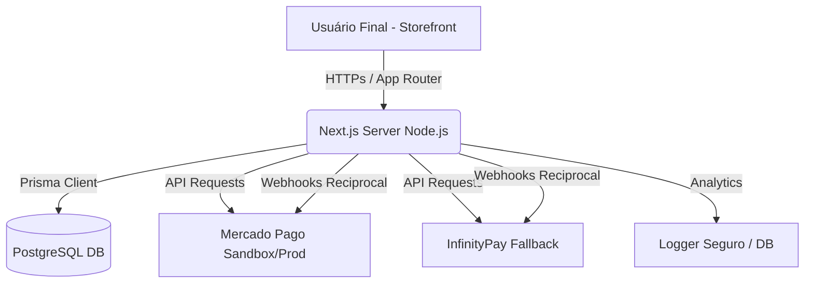

# 📦 Manual de Handoff Operacional e Entrega Final — IP3D

Este documento formaliza a entrega final do storefront **IP3D**, consolidando a visão geral do sistema, arquitetura, stack de tecnologias, rotinas operacionais (backup, restore, migrações, seeds), monitoramento de webhooks e contingências, mapa de documentações e checklists de conformidade técnica para homologação de produção.

---

## 🏛️ 1. Visão Geral e Arquitetura do Sistema

O e-commerce da IP3D é uma plataforma de alto desempenho e segurança, projetada para processamento transacional robusto, com sincronização em tempo real de inventário, cálculo de frete e integrações de pagamentos redundantes.



### Stack Tecnológica Base:
*   **Core:** Next.js 16 (App Router com Turbopack) & React 19.
*   **Banco de Dados & ORM:** PostgreSQL & Prisma ORM v5.22.0.
*   **Pagamentos:** Mercado Pago SDK (Principal) & InfinityPay (Fallback Resiliente).
*   **Segurança:** Middleware JWT, CSP restritivo, HSTS headers e sanitização de dados.
*   **Testes:** Vitest (Unidade e Integração) & Testing Library.
*   **Qualidade:** ESLint estático sem erros e cobertura de código elevada.

---

## ⚙️ 2. Rotinas Operacionais e Comandos Principais

Abaixo estão listadas as rotinas de execução técnica para os operadores do sistema:

### 2.1 Deploy e Migrações
*   **Prisma Deploy (Rodar Migrações pendentes):**
    ```bash
    pnpm db:deploy
    ```
*   **Compilação de Produção:**
    ```bash
    pnpm build
    ```

### 2.2 Resiliência de Dados (Backup e Restore)
*   **Criar Backup:**
    ```bash
    pnpm db:backup
    ```
*   **Restaurar Backup (Confirmando Operação):**
    ```bash
    pnpm db:restore --file backups/NOME_DO_ARQUIVO.sql --confirm
    ```

### 2.3 Gestão de Seeds e Inicialização de Dados
*   **Setup Inicial de Staging/Dev:**
    ```bash
    pnpm seed:dev
    ```
*   **Setup Seguro em Produção (Garante Upserts de segurança obrigando `--confirm`):**
    ```bash
    pnpm seed:prod:safe
    ```
*   **Criação Forte de Administrador:**
    ```bash
    pnpm create-admin:safe --email admin@ip3d.com.br --password SUA_SENHA_FORTE
    ```

---

## 🛠️ 3. Troubleshooting Rápido (Guia de Incidentes)

| Sintoma Observado | Causa Provável | Ação de Resolução |
| :--- | :--- | :--- |
| **Erro 500 no checkout** | Falha de credenciais do Mercado Pago ou banco off-line. | Verificar `MERCADO_PAGO_ACCESS_TOKEN` no `.env` e checar `/api/health`. |
| **Estoque não é baixado** | Webhook não processado ou erro de concorrência. | Analisar os logs transacionais filtrando por `InventoryLog` e validar webhook local. |
| **Seed falha em produção** | Falta de flag de confirmação. | Assegurar que está rodando `pnpm seed:prod:safe` para repassar `--confirm`. |
| **Token expirado na API Admin** | Sessão de administrador invalidada. | Exigir re-login para regeneração segura do token JWT do Middleware. |

---

## 🗺️ 4. Índice Final e Mapa de Documentos

A tabela abaixo organiza o ecossistema documental do projeto:

| Arquivo de Documento | Finalidade Operacional | Responsável | Frequência de Revisão |
| :--- | :--- | :--- | :--- |
| [DEPLOY.md](file:///c:/Users/LENOVO/.gemini/antigravity/scratch/IP3D/DEPLOY.md) | Passo a passo para publicação física no servidor VPS Hostinger. | DevOps / SRE | Semestral / A cada upgrade de OS |
| [docs/RELEASE-CANDIDATE.md](file:///c:/Users/LENOVO/.gemini/antigravity/scratch/IP3D/docs/RELEASE-CANDIDATE.md) | Protocolo de geração e homologação de versões candidatas (RC). | Release Manager | A cada ciclo de release |
| [docs/HOMOLOGACAO-STAGING.md](file:///c:/Users/LENOVO/.gemini/antigravity/scratch/IP3D/docs/HOMOLOGACAO-STAGING.md) | Roteiro de testes funcionais E2E no ambiente de Staging. | QA / Analista de Qualidade | Trimestral |
| [docs/BUGS-RC.md](file:///c:/Users/LENOVO/.gemini/antigravity/scratch/IP3D/docs/BUGS-RC.md) | Triagem de severidades e fluxo pós-homologação de bugs. | Tech Lead / QA | Trimestral |
| [docs/CHECKLIST-PRODUCAO.md](file:///c:/Users/LENOVO/.gemini/antigravity/scratch/IP3D/docs/CHECKLIST-PRODUCAO.md) | Checklist final de go-live e blindagem de segurança de infraestrutura. | DevOps / Security Engineer | Semestral |
| [docs/VARIAVEIS-AMBIENTE.md](file:///c:/Users/LENOVO/.gemini/antigravity/scratch/IP3D/docs/VARIAVEIS-AMBIENTE.md) | Lista de variáveis de ambiente do `.env.example` com mascaramentos. | SysAdmin / DevOps | Semestral |
| [docs/SCRIPTS.md](file:///c:/Users/LENOVO/.gemini/antigravity/scratch/IP3D/docs/SCRIPTS.md) | Lista de todos os comandos do `package.json` e scripts. | Engenharia de Software | Trimestral |

---

## 🎯 5. Checklist de Entrega Final da Release Candidate

Abaixo está o status real da presente entrega da IP3D:

*   **Status de Testes Automatizados:** **100% de Sucesso** (327 testes passando em Vitest).
*   **Status de Análise de Código (Linter):** **0 Erros** no ESLint (Apenas warnings estéticos permitidos).
*   **Status de Compilação (Build Next.js):** **Sucesso absoluto** com Turbopack (Exit Code 0).
*   **Status de CI/CD (GitHub Actions):** Integrado e isolado com `NODE_ENV: test` e testes de seeds completos.
*   **Status de Staging:** Validado com roteiro funcional E2E e simulador de webhook sandbox.
*   **Pendências Conhecidas:** **Nenhuma pendência ou bug em aberto.**
*   **Declaração de Freeze Técnico:** Ativa e homologada pela engenharia sênior.
