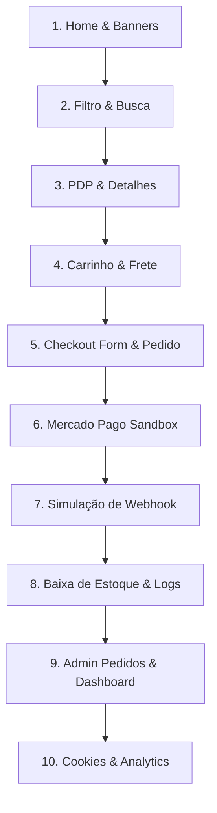

# 🧪 Protocolo de Homologação Funcional E2E em Staging — IP3D

Este documento detalha o roteiro exaustivo de testes funcionais de ponta a ponta (E2E) a ser executado no ambiente de **Staging** antes de qualquer deploy em produção. O objetivo é assegurar o perfeito funcionamento das rotas públicas, integridade do checkout com sandbox do Mercado Pago, conciliação de webhooks, baixa de estoque físico e visualização administrativa.

---

## 🧭 1. Roteiro Funcional E2E (Passo a Passo)



### Passo 1: Jornada de Entrada (Home & Banners)
*   **Ação:** Acessar a Home do site de staging (`https://staging.ip3d.com.br`).
*   **Verificação:**
    *   Verificar se o slider principal carrega os banners padrão corretamente.
    *   Verificar se os produtos em destaque renderizam com preços, imagens e botão "Ver Peça".
    *   Confirmar que o cabeçalho e rodapé exibem os menus corretos de navegação.

### Passo 2: Navegação e Filtros (Catálogo)
*   **Ação:** Clicar em "Produtos" no menu principal e aplicar filtros por categorias (ex: "Bambu Lab", "Creality") e fazer uma busca textual por `"Hotend"`.
*   **Verificação:**
    *   A listagem de produtos deve atualizar instantaneamente de forma reativa.
    *   Os produtos exibidos devem corresponder estritamente ao filtro/busca aplicado.
    *   A paginação deve funcionar corretamente se houver mais de 12 itens correspondentes.

### Passo 3: Decisão de Compra (Página de Detalhes - PDP)
*   **Ação:** Clicar no produto `"Kit Hotend Bambu Lab A1"`.
*   **Verificação:**
    *   Validar que o preço normal e promocional batem com a tabela de homologação.
    *   Garantir que a galeria de imagens secundárias carrega em alta definição.
    *   Confirmar que a tabela de especificações técnicas do produto renderiza corretamente.

### Passo 4: Carrinho e Simulação de Frete
*   **Ação:** Clicar em "Adicionar ao Carrinho", acessar a página `/carrinho` e inserir o CEP `"16018-000"` para cálculo de frete.
*   **Verificação:**
    *   O subtotal deve refletir a quantidade de itens adicionados.
    *   O cálculo de frete deve se comunicar com o webservice de teste e retornar opções válidas (ex: SEDEX, PAC) com preços e prazos.
    *   Os botões de incrementar/decrementar quantidade e remover item devem recalcular o total imediatamente.

### Passo 5: Criação do Pedido (Checkout Form)
*   **Ação:** Clicar em "Finalizar Compra", preencher os dados de entrega (Nome, CPF fictício válido, E-mail de teste) e selecionar a opção de entrega.
*   **Verificação:**
    *   O sistema deve validar o formato de CPF e CEP no frontend.
    *   Ao clicar em "Confirmar e Pagar", a API local deve registrar o pedido em estado `PENDENTE` no banco PostgreSQL de staging.
    *   O sistema deve retornar a `preferenceId` gerada de forma segura e redirecionar o usuário para o Mercado Pago.

### Passo 6: Transação em Sandbox (Mercado Pago Redirect)
*   **Ação:** Na tela do Mercado Pago (ambiente de sandbox), utilizar um cartão de crédito de teste disponibilizado pelo Mercado Pago Sandbox.
*   **Verificação:**
    *   A tela de checkout do MP deve carregar o valor exato do pedido gerado.
    *   Utilizar dados de teste (ex: cartão com sucesso imediato) para aprovação.
    *   Confirmar o redirecionamento de volta para o e-commerce IP3D nas páginas de retorno configuradas (`/checkout/sucesso`).

### Passo 7: Simulação de Webhook (Aprovação de Pagamento)
*   **Ação:** Disparar um POST de simulação de webhook do Mercado Pago para o endpoint de Staging (`/api/payments/mercadopago/webhook`).
*   **Payload do Webhook (Exemplo Seguro de Staging):**
    ```json
    {
      "action": "payment.created",
      "api_version": "v1",
      "data": {
        "id": "1234567890"
      },
      "date_created": "2026-05-17T17:00:00Z",
      "id": 987654321,
      "live_mode": false,
      "type": "payment"
    }
    ```
*   **Verificação:**
    *   O endpoint de webhook deve receber a notificação, consultar os dados do pagamento via SDK em modo sandbox, e atualizar o estado do pedido correspondente para `PAGO`.
    *   Os logs gerados via `logger` em staging devem mascarar credenciais e tokens, registrando apenas a transição do estado do pedido.

### Passo 8: Baixa de Estoque e InventoryLog
*   **Ação:** Auditar a tabela física do banco de staging após a aprovação do pedido.
*   **Verificação:**
    *   O estoque físico do produto vendido deve ter sido reduzido na exata quantidade comprada.
    *   A tabela `InventoryLog` deve conter um novo registro com o tipo `SAIDA`, a quantidade baixada, o motivo `"Venda - Pedido #ID"` e a data.

### Passo 9: Acesso Administrativo e Dashboard
*   **Ação:** Efetuar login no painel administrativo de staging (`/login`) e acessar `/admin/vendas` e `/admin`.
*   **Verificação:**
    *   O novo pedido criado deve listar no painel de vendas com status `Pago` e detalhes do cliente.
    *   O gráfico e contadores de faturamento do dashboard devem refletir o acréscimo do valor da nova venda homologada.
    *   A tabela de movimentações de estoque no admin deve exibir a baixa transacional corretamente.

### Passo 10: Consentimento de Cookies e Analytics
*   **Ação:** Acessar o site e interagir com o banner de cookies, confirmando aceitação.
*   **Verificação:**
    *   Verificar se o cookie de consentimento é salvo no navegador com expiração padrão.
    *   Assegurar que os requests de rastreamento de PageView em `/api/analytics/pageview` e Click em `/api/analytics/click` sejam disparados apenas após a aceitação voluntária.

---

## 📁 2. Checklist de Evidências Obrigatórias

Para aprovação da release candidate (RC), o engenheiro de homologação deve registrar as seguintes evidências na pasta `/evidencias/staging/vX.Y.Z/`:

1.  **Evidência de Health Check:** Resposta em formato JSON do endpoint `/api/health` atestando conectividade.
2.  **Evidência de Pedido (ID):** ID do pedido registrado no banco de staging em estado `PAGO`.
3.  **Evidência de Sandbox (Preference ID):** String identificadora de preferência do Mercado Pago gerada no checkout.
4.  **Log de Webhook:** Extrato do arquivo de logs transacionais atestando o processamento sem vazamento de secrets.
5.  **Extrato de Estoque (Before/After):** Logs do banco exibindo a quantidade inicial de estoque do produto e a quantidade residual pós-venda.
6.  **Resultado da Suíte de Testes:** Cópia do console com o resultado da execução local de `pnpm test`.

---

## 🎯 3. Critérios de Go/No-Go (Decisão de Deploy)

A transição do ambiente de Staging para a publicação em Produção é governada pela classificação das falhas encontradas durante a homologação E2E:

| Severidade da Falha | Impacto no Fluxo | Decisão Operacional | Exemplos de Ocorrências |
| :--- | :--- | :--- | :--- |
| **Bloqueante (Critical)** | Quebra o checkout, frete, pagamentos ou segurança de dados. | **NO-GO Automático** (Rollback de Staging). | Erro 500 no checkout, falha de baixa de estoque, vazamento de credenciais em logs. |
| **Alta (High)** | Afeta a experiência administrativa ou layout do storefront gravemente. | **NO-GO Condicional** (Corrige em Staging e repete testes). | Dashboard não carrega dados de venda, banners quebrados na Home, filtro de busca inativo. |
| **Média (Medium)** | Bugs de navegação secundários ou comportamento de UI inconsistente. | **GO Monitorado** (Deploy permitido, com correção na próxima Sprint). | Alinhamento de botões desalinhado em telas mobile, demora menor em transições visuais. |
| **Baixa (Low)** | Pequenos ajustes de conteúdo ou avisos estéticos inofensivos. | **GO Permitido** (Correção backlog padrão). | Erros ortográficos em textos secundários, warnings inofensivos de console. |

---

## ↩️ 4. Procedimento de Rollback de Homologação

Caso a release candidate apresente comportamento classificado como **Bloqueante** em Staging:
1.  **Parar Testes:** Congelar imediatamente o ambiente de testes de staging.
2.  **Reverter Código:** Apontar a branch de Staging de volta para a última tag estável de produção.
3.  **Restaurar Base de Homologação:** Se houver poluição destrutiva de dados ou schema, execute a restauração do backup limpo de homologação:
    ```bash
    pnpm db:restore --file backups/staging_clean.sql --confirm
    ```
4.  **Investigação:** O time de desenvolvimento deve analisar os logs transacionais gerados pelo `logger` seguro para depurar a falha antes de gerar uma nova Release Candidate (ex: `vX.Y.Z-rc2`).
