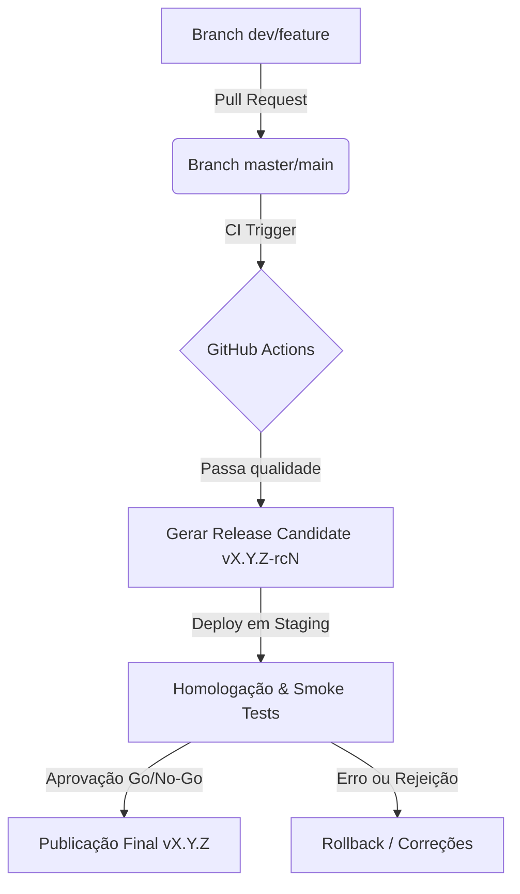
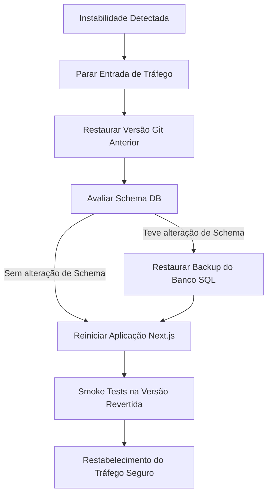

# 🚀 Manual de Release Candidate e Deploy — IP3D

Este documento detalha o protocolo formal de qualidade para geração de **Release Candidates (RC)**, homologação, deploy em produção e planos de contingência de rollback para o e-commerce IP3D.

---

## 📋 1. Processo de Homologação (Pipeline de Release Candidate)

Toda nova versão destinada à produção deve obrigatoriamente seguir a esteira de Release Candidate:



### 1.1 Versionamento SemVer
Adotamos o padrão de Semantic Versioning para marcação de releases:
*   **Release Candidate:** Tags com formato `vX.Y.Z-rcN` (ex: `v2.4.0-rc1`).
*   **Release Final:** Tags com formato `vX.Y.Z` (ex: `v2.4.0`).
*   A criação da tag deve ser acompanhada do changelog detalhado em ambiente Git.

---

## ⚡ 2. Checklist de Release Candidate (Go/No-Go)

Antes de autorizar a migração do tráfego público para a nova versão, o Release Manager deve auditar o cumprimento de todos os critérios abaixo:

### 2.1 Checklist Pré-Deploy (Estágio 1 - Preparação)
- [ ] **Integração Contínua:** GitHub Actions com status verde em todas as etapas (Prisma, lint, testes, build).
- [ ] **Backup Quente Ativo:** Executar o script de backup seguro para garantir um ponto de restauração válido do banco de dados antes da publicação:
    ```bash
    pnpm db:backup
    ```
- [ ] **Evidência de Backup:** Verificar se o dump SQL foi salvo de forma íntegra na pasta `/backups/` local e replicado no storage secundário.

### 2.2 Checklist de Deploy (Estágio 2 - Execução)
- [ ] **Migração de Schema:** Executar as migrações Prisma pendentes no banco de produção usando o comando seguro do pipeline:
    ```bash
    pnpm db:deploy
    ```
- [ ] **Visualização de Seeds:** Se houver adição de novos blocos visuais obrigatórios ou novas categorias cruciais, rode o seed seguro contendo confirmação em lote:
    ```bash
    pnpm seed:prod:safe
    ```
- [ ] **Verificação de Logs:** Monitorar os logs de inicialização do PM2 (`pm2 logs`) para descartar erros de conexão do Next.js com o banco.

### 2.3 Checklist Pós-Deploy (Estágio 3 - Validação de Fumaça / Smoke Tests)
- [ ] **Health Check:** Acessar o endpoint `/api/health` e validar se o status retornado é `200 OK` e o banco PostgreSQL está operacional.
- [ ] **Acesso ao Storefront:** Entrar nas páginas `/`, `/produtos`, `/carrinho`, `/sobre` e `/contato` para validar a renderização livre de erros HTTP 500.
- [ ] **Navegação Administrativa:** Efetuar login no painel administrativo `/login` e navegar pelos menus de Vendas e Inventário.
- [ ] **Auditoria de Webhook:** Simular ou verificar o webhook de pagamento do Mercado Pago em `/api/payments/mercadopago/webhook`, testando se o processador de notificações está ativado de forma segura e com validação de assinaturas ativa.

---

## 🎯 3. Critérios de Aprovação e Reprovação (Go/No-Go)

A tomada de decisão para aprovação da release em produção é binária e intransigente:

| Item | Critério de Aprovação (Go) | Critério de Reprovação (No-Go) |
| :--- | :--- | :--- |
| **Suíte de Testes** | 100% de sucesso (320+ testes passando). | Qualquer teste unitário/integração falhando. |
| **Lint e Build** | Compilação limpa (Exit Code 0). | Avisos de sintaxe severa ou quebra de build. |
| **Health Check** | Status `200 OK` com resposta `< 100ms`. | Erro 500 ou banco de dados inacessível. |
| **Checkout Flow** | Transações simuladas concluem sem quebra de estado. | Erros ou travamentos de carrinho/pagamento. |
| **Segurança** | Zero senhas padrões em produção. | Presença de vulnerabilidades conhecidas ou credenciais padrão. |

> [!CAUTION]
> **REPROVAÇÃO AUTOMÁTICA:** A presença de qualquer erro que afete o fluxo transacional (carrinho, frete ou processamento de pagamentos) causará a reprovação imediata da release, acionando o plano de rollback.

---

## ↩️ 4. Procedimento de Rollback (Plano de Contingência)

Caso a release seja reprovada nos smoke tests pós-deploy ou apresente instabilidade severa sob carga em produção, siga imediatamente o roteiro de reversão:



### 4.1 Passo a Passo da Reversão (Rollback)

1.  **Reverter Pacote/Git:**
    Voltar a aplicação para a tag estável anterior de produção:
    ```bash
    git checkout tags/vSTABLE_PREVIOUS_VERSION
    pnpm install --frozen-lockfile
    pnpm build
    ```
2.  **Restaurar Banco de Dados (se aplicável):**
    Se a release com problemas introduziu alterações de banco destrutivas, reverta a base física usando o dump SQL capturado no checklist pré-deploy:
    ```bash
    pnpm db:restore --file backups/ip3d_backup_PRE_DEPLOY.sql --confirm
    ```
3.  **Reiniciar PM2:**
    Aplique o reinício seguro dos processos da aplicação:
    ```bash
    pm2 reload all
    ```
4.  **Repetir Smoke Tests:**
    Valide o endpoint `/api/health` e as rotas críticas para confirmar que o sistema retornou ao estado anterior estável.

---

## 👥 5. Responsáveis e Evidências

A responsabilidade das ações deve ser claramente atribuída para garantir rastreabilidade e governança:

*   **Release Manager (Coordenador de Deploy):**
    *   *Ação:* Executar backups, rodar migrações, aplicar a tag final e decidir o Go/No-Go com base nas métricas de homologação.
*   **QA Engineer (Analista de Qualidade):**
    *   *Ação:* Executar smoke tests de checkout, validação de navegação e reportar falhas críticas pós-deploy.
*   **DevOps / SRE (Infraestrutura):**
    *   *Ação:* Monitorar métricas de consumo de CPU/Memória do VPS, latência do endpoint de `/api/health` e restabelecer backups caso rollback seja acionado.

### 📁 Evidências Obrigatórias para Arquivamento:
As evidências de cada deploy devem ser registradas na ferramenta de gestão (ou pasta compartilhada `/deploys/` do servidor):
1.  **Logs de Sucesso da Pipeline CI** (GitHub Actions output).
2.  **Caminho do Arquivo de Dump de Segurança** (ex: `/backups/ip3d_db_2026-05-17_19-30-00.sql`).
3.  **Resultado de sucesso do Smoke Test** (print/curl response do `/api/health`).
